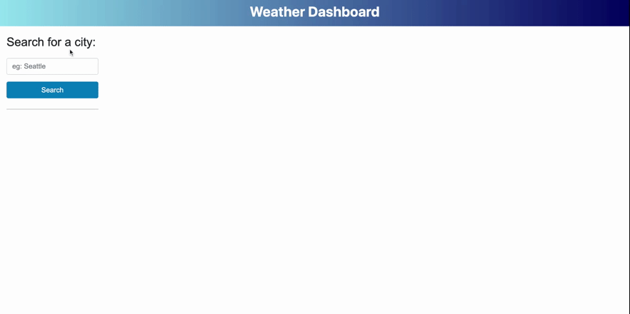

# weather-dashboard

## Description

This project is a weather dashboard. 

It allows users to view the current weather and 5 days forecast. [OpenWeather](https://openweathermap.org) is used to retrieve weather data. [Luxon.js](https://moment.github.io/luxon/#/) is used to display date.

View the deployed website: https://ruxinqu.github.io/weather-dashboard/

## Usage

* The user enters a city name and click "search", then the current weather and 5 days forecast will display.
* The weather icon, temperature, wind speed, humidity are provided in both current weather and 5 day forecast. 
* The current weather also provides UV index, presented with a color from green to violet indicating increased severity.
* **Autocomplete** of 385 American cities is added to the input field to make the search easier.
* Once a city is searched, the name will be added to the search history list on the left of the page, and saved in local storage.
* Each city can only appear in the search history **ONCE**.
* The city name appear in the page will always have the first letter captical for consistency.
* The animation below shows the web application's appearance and functionality:

## Sources Referenced
Google || [Codecademy](http://codecademy.com) 

## Technologies Used
* [jQuery](https://jquery.com)
* [Bootstrap](https://getbootstrap.com) 
* [Luxon.js](https://moment.github.io/luxon/#/)
* [OpenWeather](https://openweathermap.org)

